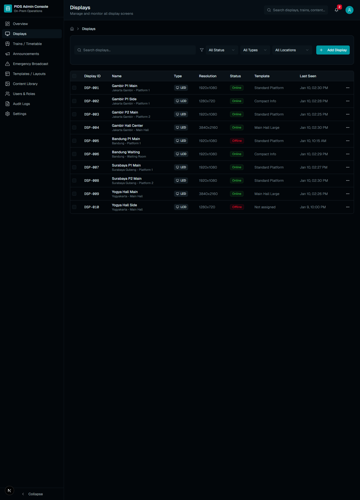
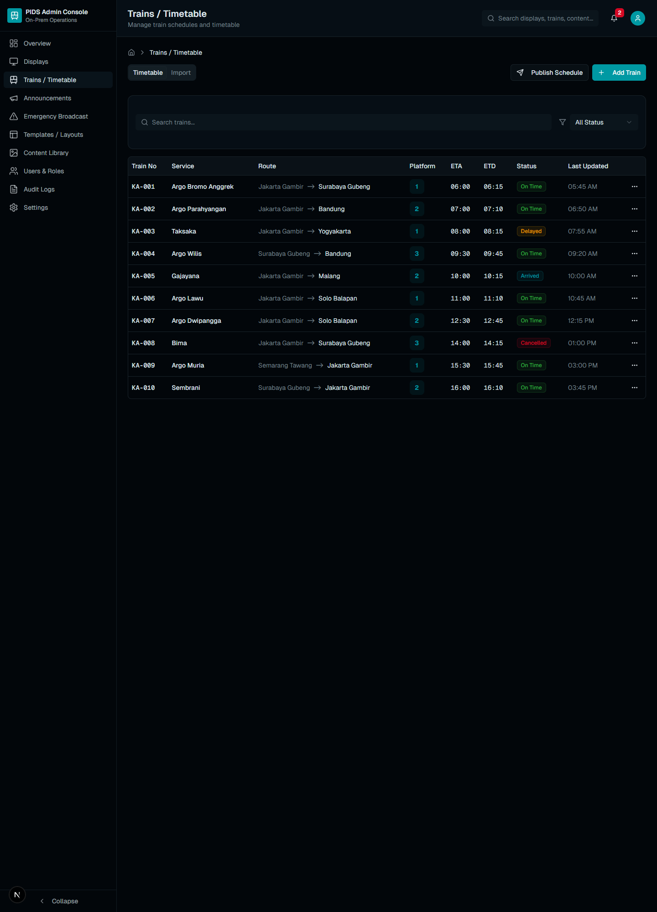
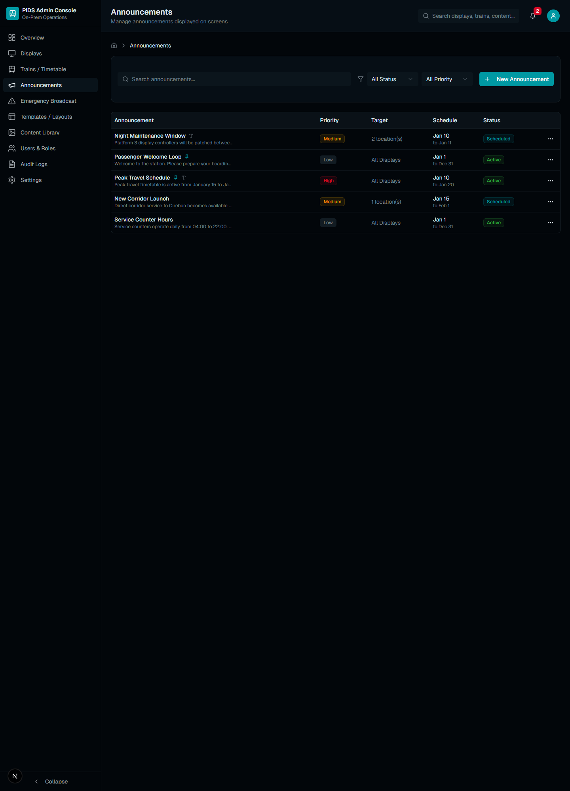

# PIDS On-Prem Dashboard

Admin dashboard concept for managing an on-prem Passenger Information Display System (PIDS) environment.

This project was initially scaffolded from a v0 export, then adapted into a local Next.js codebase and refined as a portfolio-ready dashboard prototype. It focuses on the operational surface of a station display management system: display monitoring, train timetable control, announcements, emergency broadcast management, media assets, audit logs, and settings.

## Why This Project Exists

I built this as a product-style admin dashboard concept to show how a generated UI can be turned into a more intentional engineering project. The goal was not just to render screens, but to shape the export into a believable operations console with reusable components, route structure, realistic mock data, and a cleaner presentation for portfolio review.

## Highlights

- Dashboard overview with operational KPIs and recent activity
- Display monitoring pages with detail routes
- Timetable, announcements, emergency broadcast, media, users, logs, and settings sections
- Reusable UI components built with Next.js, React, Radix UI, and Tailwind CSS
- Mock data layer suitable for replacing with API integrations later

## What I Changed From The Initial Export

- imported the downloaded v0 ZIP into a clean local repository
- installed and validated the full Next.js app locally
- renamed and repositioned the project as a portfolio-ready admin console
- refined visible UI copy and navigation branding
- replaced several generic demo strings with more neutral operational content
- kept the structure ready for future API, auth, and real-time integrations

## Tech Stack

- Next.js 16
- React 19
- TypeScript
- Tailwind CSS
- Radix UI
- Recharts
- pnpm

## Local Development

```bash
pnpm install
pnpm dev
```

Open [http://localhost:3000](http://localhost:3000) after the dev server starts.

## Production Check

```bash
pnpm build
pnpm start
```

## Screenshots

Gallery assets are stored in the `docs/` folder so the repository preview looks stronger at a glance:

```text
docs/
  overview.png
  displays.png
  timetable.png
  announcements.png
```

Recommended captions:

- `overview.png`: Operations overview with KPI cards, trend charts, and recent activity
- `displays.png`: Display fleet management with health, templates, and bulk actions
- `timetable.png`: Timetable control surface for schedule updates and publishing
- `announcements.png`: Announcement scheduling workflow with priority and targeting

## Gallery




## Portfolio Notes

This repository is positioned as a product-style admin dashboard concept. The current implementation uses mock operational data and is a good base for future improvements such as:

- API integration for live display and train updates
- Authentication and role-based access
- Search, filtering, and bulk actions
- Real-time status updates via websockets or polling
